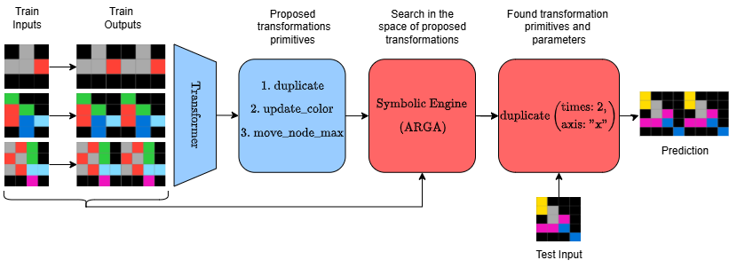

### NSA: Neuro-symbolic ARC Challenge

# Abstract
The Abstraction and Reasoning Corpus (ARC) evaluates general reasoning capabilities that are difficult for both machine learning models and combinatorial search methods. 
We propose a neuro-symbolic approach that combines a transformer for proposal generation with combinatorial search using a domain-specific language. 
The transformer narrows the search space by proposing promising search directions, which allows the combinatorial search to find the actual solution in short time.
We pre-train the trainsformer with synthetically generated data.
During test-time we generate additional task-specific training tasks and fine-tune our model. %We generate synthetic tassks to train ourpre-tranin our transformer and finto fine-tune it during test-time.% on taskeOur transformer is trained on synthetic tasks and fine-tuned for each new task via test-time adaptation.
Our results surpass comparable state of the art on the ARC evaluation set by 27\% and compare favourably on the ARC train set.

# Code
Our solution is divided into three parts:

1. Data Generation:
python -m auxilaries.generate_transformation 

2. Pre-training
python -m small_transformer_based.train

3. Evaluation
python -m small_transformer_based.eval